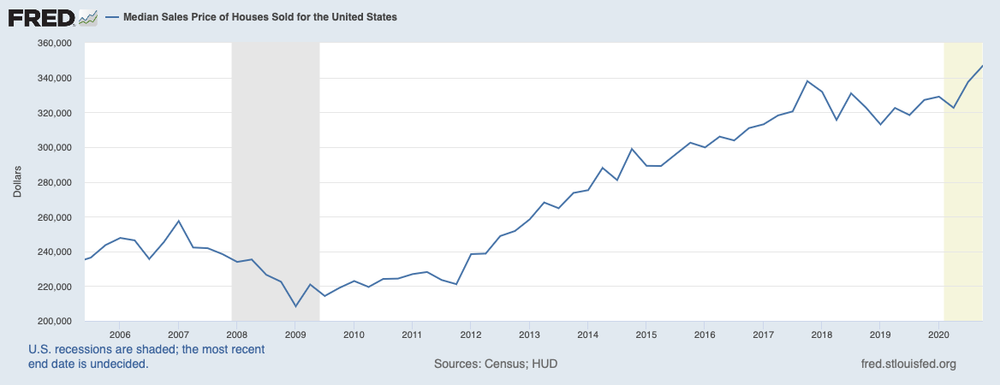
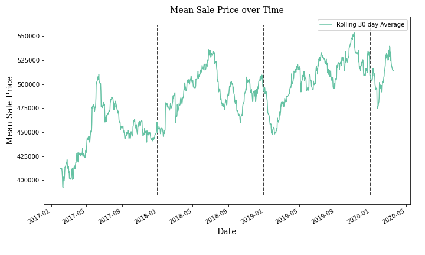
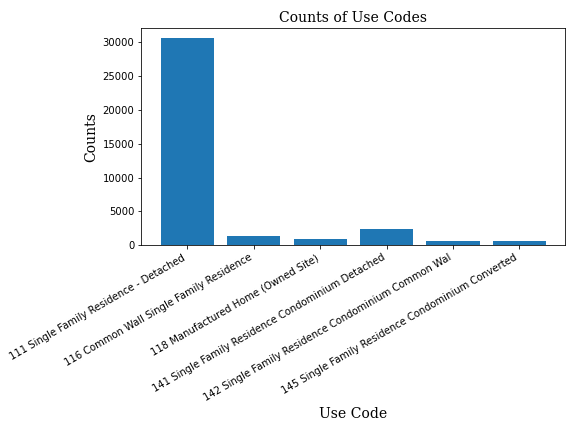
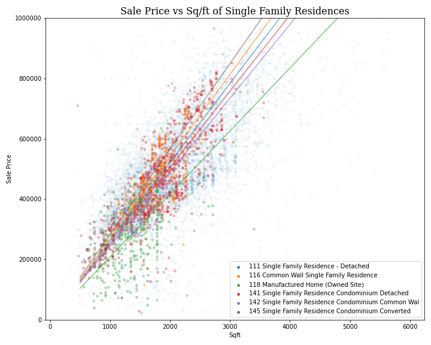
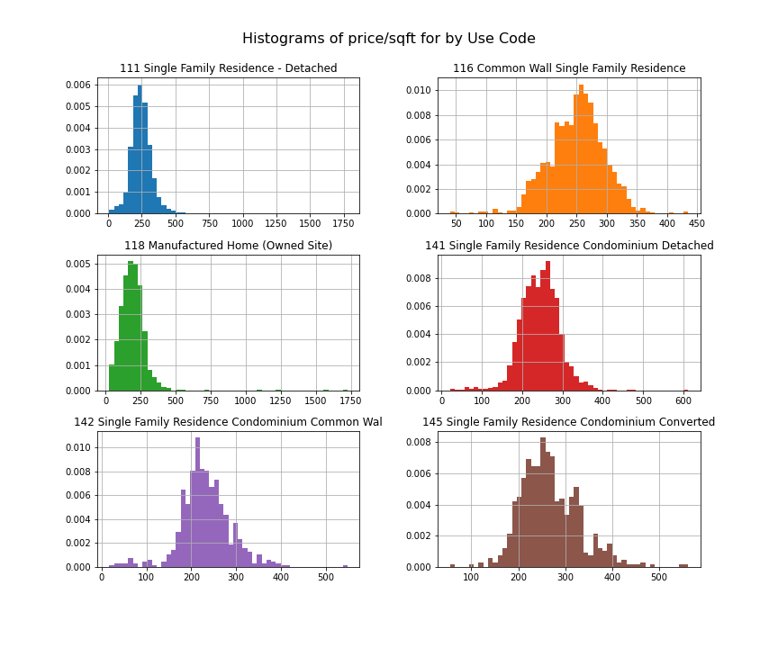
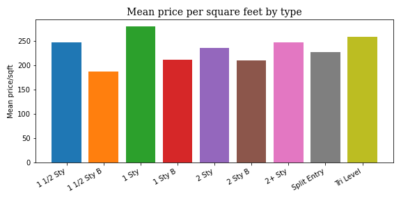
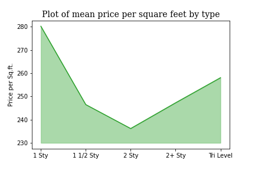
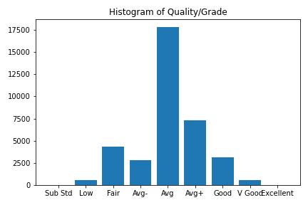
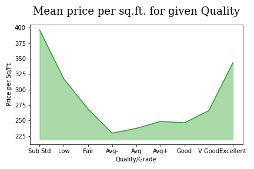

# Snohomish County Housing Market Analysis
Exploratory Data Analysis of Home Sales in Seattle Area

Home prices in the Greater Seattle Area have been rapidly increasing for over a decade. This continued increase in price has made the area a prime location for investment, but also a barrier to those looking to buy their first home.

As a current resident I hope to gain some insight in this market as a potential owner and investor. What influences the value of a home? Using publicly available information of home sales I hope to explore factors that influence price or correlate with price and value. These correlations could be valuable to validate potential returns on investment. 

## Data
Snohomish County provides data for home sales through a web search [available here.](http://www.snoco.org/app4/sas/assessor/services/salessearch.aspx) The data available from this search is shown below in the first row. As we can see some values could be missing, but certain columns always had values including: parcel, date of sale, sale price, and use code. The county also provides parcel information in a separate search, but the information in the sale query has the primary columns I would like to explore. The information was scraped from the web with multiple queries since each individual search result had a max return value of 800 results. Data was stored in a Mongo Database as strings and were cleaned through a data pipeline into the useable types shown in the second row. 

|    |       Parcel # | Date of Sale        |   Sale Price |   Lot Size |   Year Built | Type      | Quality/Grade   |   Sqft | Address                  | City      |    Nbhd |   Use Code |
|---:|---------------:|:--------------------|-------------:|-----------:|-------------:|:----------|:----------------|-------:|:-------------------------|:----------|--------:|-----------:|
|  0 | 31051100400500 | 1/31/2020 12:00:00 AM | $2,500,000.00 |       5.44 |              |           |                 |        | 21015 STATE ROUTE 9 NE | Arlington | Nbhd:5203000 |        521 |
|  2 | 00960009607300 | 2020-01-31 12:00:00 |        75000 |       0    |         1996 | Dbl Wide  | V Good          |   1620 | 20227 80TH AVE NE SPC 73 | Arlington | 2408906 |        119 |

## Exploratory Data Analysis

One of our primary columns to observe is price. However it may be difficult to draw conclusions when the prices for homes change over time. One assumption we will have to make is that any possible influencers of price change uniformly between the different factors. This allows us to examine a larger dataset and at the moment I hope to draw general conclusions that are not time specific. 

### Narrowing to Single Family Residences
#### Use codes
The data we would like to observe specifically are values for single family residences. This is the most available home type and the lowest cost of entry for both investors and people looking for a place to live. Use Codes distinguish the different types of homes. T

As we can see, the majority fall in the 111 Single Family Residence - Detached. This is what one would imagine as the "Standard House": no shared walls on its own property. 

Another assumption I will make is that a larger home has a higher price as we can see below. This is fairly obvious and intuitive, so in order to make general conclusions I will normalize this price by comparing a common metric for home values: Price per Square foot. 

I would like to do see if there is a significant difference in value based on the different use codes. To do so I will use a t-test and test against my null hypotheses that there is no significant difference in price per square foot between the different use codes. Before testing I will confirm that the distributions of the price per square feet are normal. 

Now I know the distributions are normal I can determine if the difference is significant. I would like to be 90% confident before rejecting any null hypothesis After comparing the data for different use codes I found that I could not reject the following hypotheses:
1. Single Family Residences - Detached are drawn from the same distribution as Common Wall Single Family Residences.
2. Single Family Residences - Detached are drawn from the same distribution as Single Family Residence Condominium Detached.  

The 1st case above had a p-value of 0.20 and the 2nd had a p-value of 0.102. Though the p-value was close to my rejection threshold, I did not have enough evidence to reject my hypothesis in general. Looking at specific date ranges may yield different results if I were to do additional exploration. But when purchasing a home in general, one should consider the mean price per square foot for the given use code and that they are generally different distributions. 

|   Use Code |   price/sqft |
|-----------:|-------------:|
| Single Family Residence-Detahced |      246.758 |
| Common Wall Single Family Residence |      249.633 |
| Manufactured Home (Owned Site) |      193.544 |
| Condominium Detached |      244.02  |
| Condominium Common Wall |      232.178 |
| Condo converted from Apartments |      267.178 |

#### Types

Homes are also categorized by types. This factor may also be influencing home values. We can see the mean of price per square feet by type below:

I will take the null hypothesis that there is no difference in price per square foot between different types of home. Following a similar process as used in use codes; I determined that the distributions of price per square feet by type were normal as well. I want to be 90% confident that the distributions are different and found that the difference in value between types were significant in all but the following:
1. 1 1/2 Sty and 2+ Sty: P value of 0.8917
2. 1 Sty B and 2 Sty B: P value of 0.4035

Failing to reject these types are distributed differently brings up some more questions. Are these being valued similarly, or is this giving some insight into a distribution of value based on how many stories there are?

With the given evidence the only conclusion I would make at the moment is that 2 story homes are different from the others and has the best value in terms of price per square feet. 

#### Quality/Grade

I would expect that Quality/Grade of a home would directly influence the price and value of a home. Qualities of homes are determined by assessors and are supposed to follow a normal distribution. Looking below this mostly seems to be the case. 

I again adopt the null hypotheses that there is no difference in distribution between qualities. However I only have 26 points for the Sub Standard quality and 44 points for the Excellent quality for the tested data. After performting t-tests between the qualities, I could reject all except:
1. Low and Excellent: P value of 0.2697
2. Fair and V Good: P value of 0.5539
3. Avg+ and Good: P value of 0.1278

Failing to reject that a Low and Excellent quality are drawing from the same distribution may be pointing towards the relationship between price per square foot and quality. Looking at the relationship below shows that a quality of Fair or below would be a poor investment. 

### Conclusions

When looking at a home to buy, considering price per square foot allows one to have more living space per dollar spent or more return on dollar spent for an investor (rent price is directly influenced by square feet of living space). When condsidering a home to buy, I cannot confidently say that a detached single family residence is any different from a common wall single family residence or a detached condominium. When considering how many floors, the lowest price per square foot is in a 2 story home. And though quality may show that a home is worth a higher price per square foot, buying Fair or below is probably a bad deal and there is no difference between Avg+ and Good. 

Additional analysis can be done for more specific square foot ranges, especially for those in demand by renters. Additional exploration in those ranges and for earnings per square foot for rental properties would show return on investment for those properties. 

